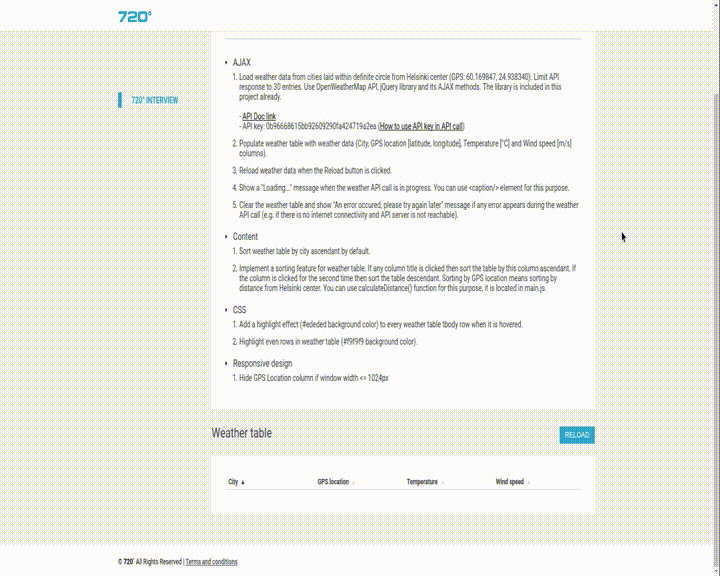

Instructions: modify the source code of this page to meet the following tasks

AJAX
Load weather data from cities laid within definite circle from Helsinki center (GPS: 60.169847, 24.938340). Limit API response to 30 entries. Use OpenWeatherMap API, jQuery library and its AJAX methods. The library is included in this project already.

- API Doc link
- API key: 0b96668615bb92609290fa424719a2ea (How to use API key in API call)
Populate weather table with weather data (City, GPS location [latitude, longitude], Temperature [°C] and Wind speed [m/s] columns).
Reload weather data when the Reload button is clicked.
Show a "Loading..." message when the weather API call is in progress. You can use <caption/> element for this purpose.
Clear the weather table and show "An error occured, please try again later" message if any error appears during the weather API call (e.g. if there is no internet connectivity and API server is not reachable).
Content
Sort weather table by city ascendant by default.
Implement a sorting feature for weather table. If any column title is clicked then sort the table by this column ascendant. If the column is clicked for the second time then sort the table descendant. Sorting by GPS location means sorting by distance from Helsinki center. You can use calculateDistance() function for this purpose, it is located in main.js.
CSS
Add a highlight effect (#ededed background color) to every weather table tbody row when it is hovered.
Highlight even rows in weather table (#f9f9f9 background color).
Responsive design
Hide GPS Location column if window width <= 1024px

  
  

